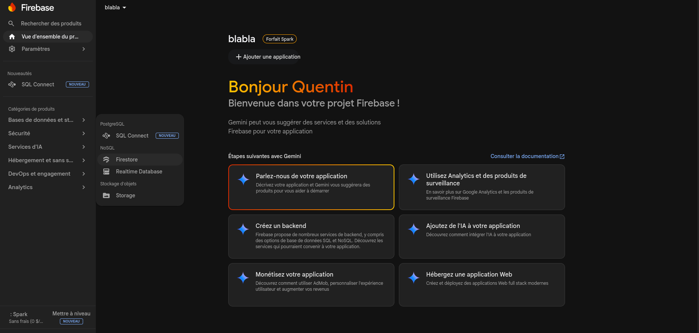
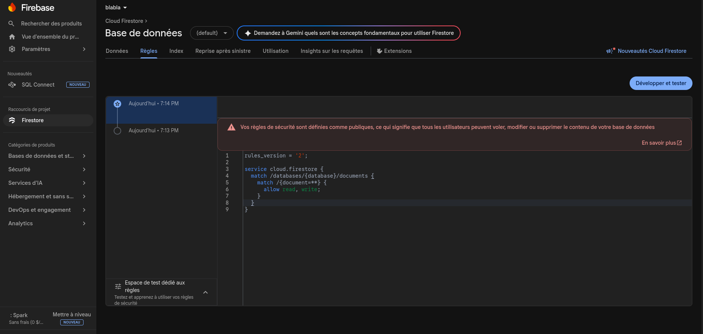
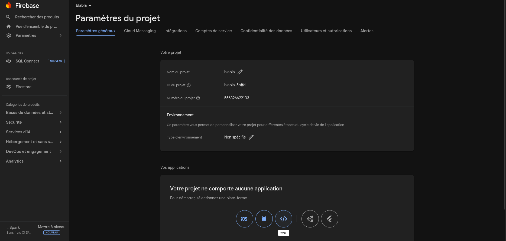

# Oneblind 2.0

**Oneblind** est une application de gestion de tournois de poker conçue pour une utilisation sur ordinateur. Elle permet de gérer les joueurs, de définir des structures de blindes et de faire tourner des tournois avec un minuteur intégré — le tout synchronisé en temps réel via votre propre projet Firebase.

Application en ligne : [www.oneblind.app](https://www.oneblind.app)

---

## Fonctionnalités

- **Joueurs** — Créez et gérez des joueurs, suivez leur historique de tournois et leurs points.
- **Structures de blindes** — Définissez des niveaux de blindes personnalisés, des antes et des durées.
- **Tournois** — Configurez des tournois avec un stack de départ, une liste de joueurs et une structure de blindes. Lancez-les avec un minuteur en direct qui avance automatiquement entre les niveaux.
- **Classements** — Classements calculés automatiquement à la fin d'un tournoi.
- **Apparence** — Choisissez votre couleur d'accentuation, le rayon des bordures et le thème du logo.
- **Multilingue** — Anglais et français pris en charge.

---

## Stack technique

- [Next.js 16](https://nextjs.org/)
- [React 19](https://react.dev/)
- [TypeScript](https://www.typescriptlang.org/)
- [Tailwind CSS v4](https://tailwindcss.com/)
- [Radix UI Themes](https://www.radix-ui.com/themes)
- [Firebase Firestore](https://firebase.google.com/docs/firestore)

---

## Configuration Firebase

Oneblind stocke toutes ses données dans une base de données Firestore. Vous devez créer votre propre projet Firebase et le connecter dans les paramètres de l'application.

### 1. Créer un projet Firebase

Rendez-vous sur [https://console.firebase.google.com](https://console.firebase.google.com) et cliquez sur **Ajouter un projet**.

---

### 2. Activer Firestore

Dans le menu latéral gauche de votre projet, allez dans **Base de données > Firestore**, puis cliquez sur **Créer une base de données**.



Lorsque vous y êtes invité :

- **Édition** — sélectionnez **Standard**
- **Emplacement du serveur** — choisissez la région la plus proche de vos utilisateurs
- **Règles de sécurité** — sélectionnez **Mode production**

---

### 3. Mettre à jour les règles de sécurité Firestore

Une fois Firestore créé, allez dans l'onglet **Règles** et remplacez les règles par défaut par les suivantes :

```
rules_version = '2';

service cloud.firestore {
  match /databases/{database}/documents {
    match /{document=**} {
      allow read, write;
    }
  }
}
```

Cliquez sur **Publier**.



> Ces règles autorisent un accès libre en lecture et en écriture. Comme l'application tourne entièrement côté client sans authentification, c'est intentionnel — ne partagez vos identifiants Firebase qu'avec des personnes de confiance.

---

### 4. Enregistrer une application web

Dans votre projet Firebase, allez dans **Paramètres du projet** puis dans l'onglet **Général**. Faites défiler jusqu'à **Vos applications** et cliquez sur l'icône **Web** (`</>`).



Donnez un nom à votre application et cliquez sur **Enregistrer l'application**. Firebase affichera un extrait de configuration comme celui-ci :

```js
const firebaseConfig = {
  apiKey: "AIzaSy...",
  authDomain: "your-project.firebaseapp.com",
  projectId: "your-project",
  storageBucket: "your-project.firebasestorage.app",
  messagingSenderId: "000000000000",
  appId: "1:000000000000:web:..."
};
```

Copiez les valeurs **`apiKey`** et **`projectId`** — vous en aurez besoin à l'étape suivante.

> Ces valeurs sont toujours disponibles ultérieurement sous **Paramètres du projet > Général > Vos applications**.

---

## Développement local

```bash
# Installer les dépendances
pnpm install

# Lancer le serveur de développement
pnpm dev
```

Ouvrez [http://localhost:3000](http://localhost:3000) dans votre navigateur.
